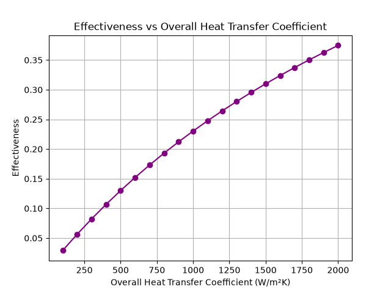
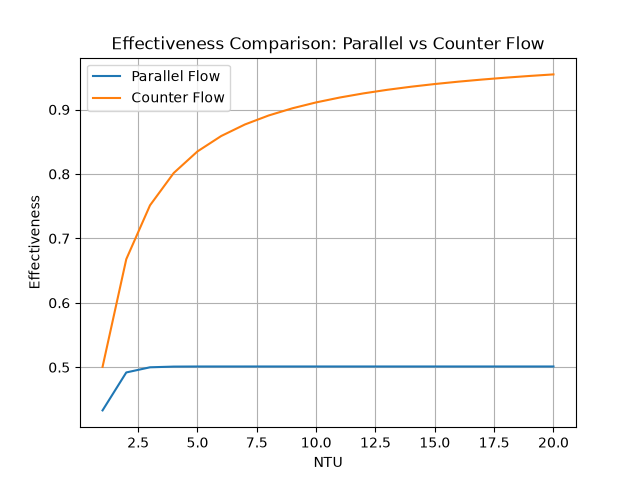
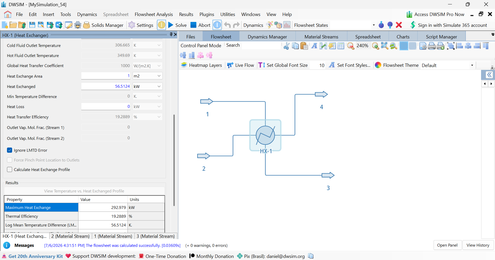
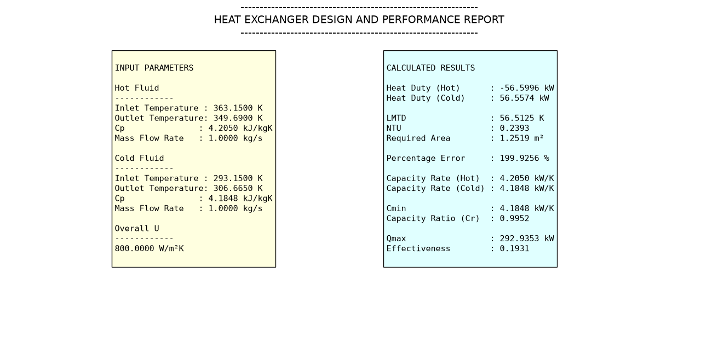

# Heat-Exchanger-Design-Tool
## Overview

A Python-based tool developed to perform thermal analysis of a double-pipe heat exchanger using the Log Mean Temperature Difference (LMTD) and NTU-Effectiveness methods. The program calculates important design parameters and generates plots to study the effect of operating variables on heat exchanger performance.


## Features

- Calculates heat duty of hot and cold fluids
- Calculates Log Mean Temperature Difference (LMTD)
- Determines required heat transfer area
- Calculates heat capacity rates and capacity ratio
- Computes maximum possible heat transfer
- Calculates heat exchanger effectiveness
- Evaluates energy balance error
- Generates engineering performance plots
- Compares parallel-flow and counterflow heat exchangers


## Methods Used
- LMTD Method
- NTU-Effectiveness Method
- Energy Balance

## Project Structure
## Repository Structure

```text
Heat-Exchanger-Design-Tool/
│
├── Heat_Exchanger_Tool.py
├── Heat_Exchanger_Report.pdf
├── README.md
└── plots/
    ├── Area_vs_U.png
    ├── Area_vs_hot_flow_rate.png
    ├── Area_vs_cold_flow_rate.png
    ├── Effectiveness_vs_U.png
    ├── Heat_Duty_vs_hot_flow_rate.png
    └── parallel_counter_vs_NTU.png
```

## Example plots
<p align="center">
  
  
</p>

## Verifying with DWSIM
<p align="center">
  
  
</p>


## Technologies Used
- **Python 3**
- **Matplotlib**
- **Math module**
- **DWSIM**
